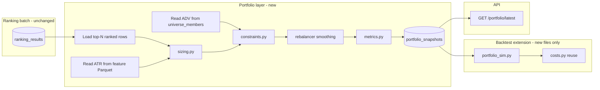
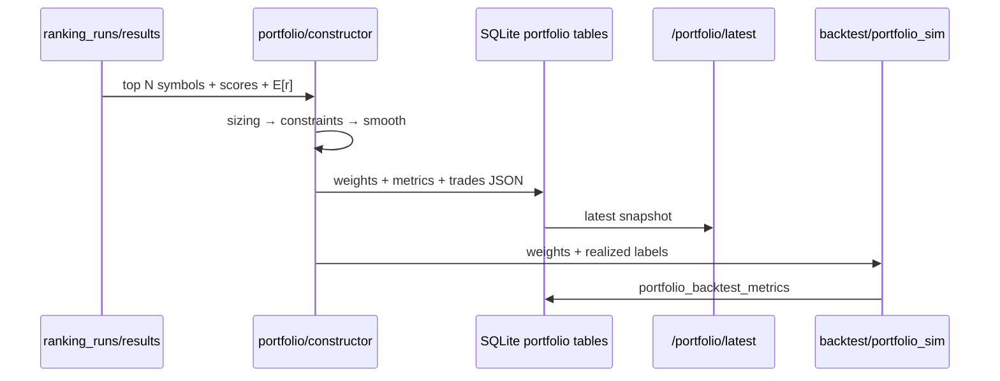

# Portfolio Construction Layer

Downstream consumer of precomputed ranking runs. Does not modify ranking, feature, or ML modules.

## Architecture



## Portfolio risk layer (downstream)

See [`portfolio_risk_layer.md`](portfolio_risk_layer.md). Run `scripts/run_portfolio_with_risk.py` after ranking; extends API `risk_layer` on `GET /portfolio/latest`.

## Data flow: ranking → portfolio → execution



## Weighting strategy comparison

| Mode | Formula | Pros | Cons |
|------|---------|------|------|
| **Equal weight** | `w_i = 1/N` | Simple, diversified | Ignores signal strength |
| **Score weighted** | `w_i ∝ final_score` | Tilts to best ranks | Can concentrate if scores skewed |
| **Vol adjusted** | `w_i ∝ final_score / ATR_14` | Less exposure to volatile names | Needs ATR from stored features |

All modes pass through: liquidity filter → max weight cap → turnover cap → EWM smooth vs prior day.

## Smoothing

`w_t = (1 - α) * w_{t-1} + α * w_new` with default `α = 0.3` (70% prior, 30% new target).

## Module layout

```
ranking_pipeline/portfolio/
  config.py
  sizing.py
  constraints.py
  rebalancer.py
  metrics.py
  constructor.py
  persistence.py
  schema.sql
ranking_pipeline/backtest/
  portfolio_sim.py      # new — does not edit evaluate.py
```
