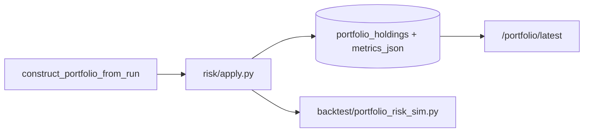

# Portfolio Risk Layer

Downstream of `ranking_pipeline/portfolio/` construction. Does not modify constructor, sizing, constraints, or ranking modules.

## Pipeline order

1. Correlation penalty on weights  
2. Sector exposure caps (`risk/exposure.py`)  
3. Beta constraint (`risk/beta.py`)  
4. Volatility targeting scale (`risk/volatility_targeting.py`)  
5. Renormalize → persist + API risk fields  

## Config defaults

| Parameter | Default |
|-----------|---------|
| Target ann. vol | 12% |
| Max beta | 1.0 |
| Beta neutral | false |
| Max sector weight | 35% |
| Correlation penalty | 0.5 strength, threshold 0.65 |
