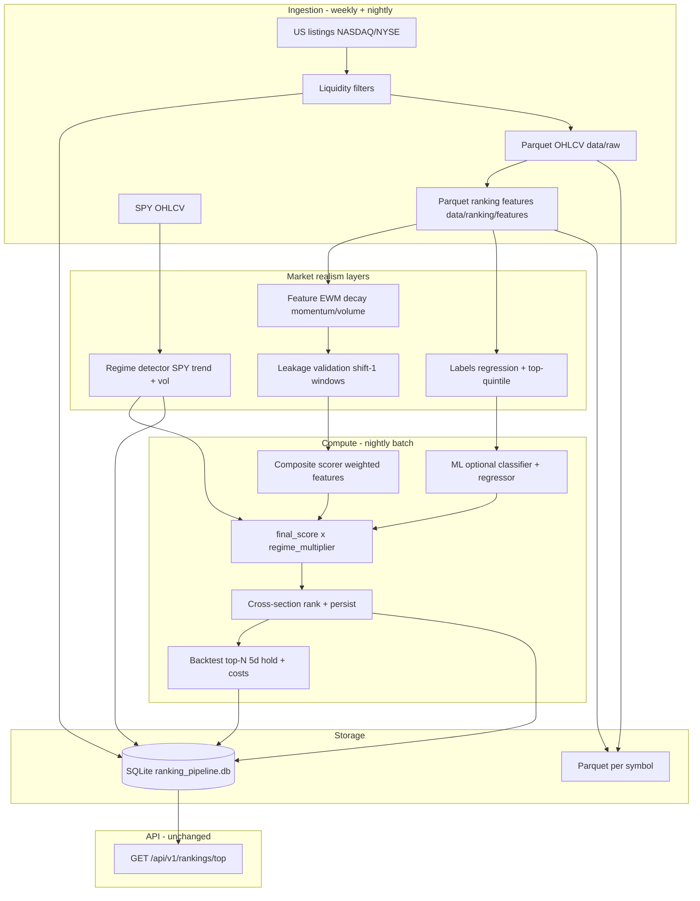
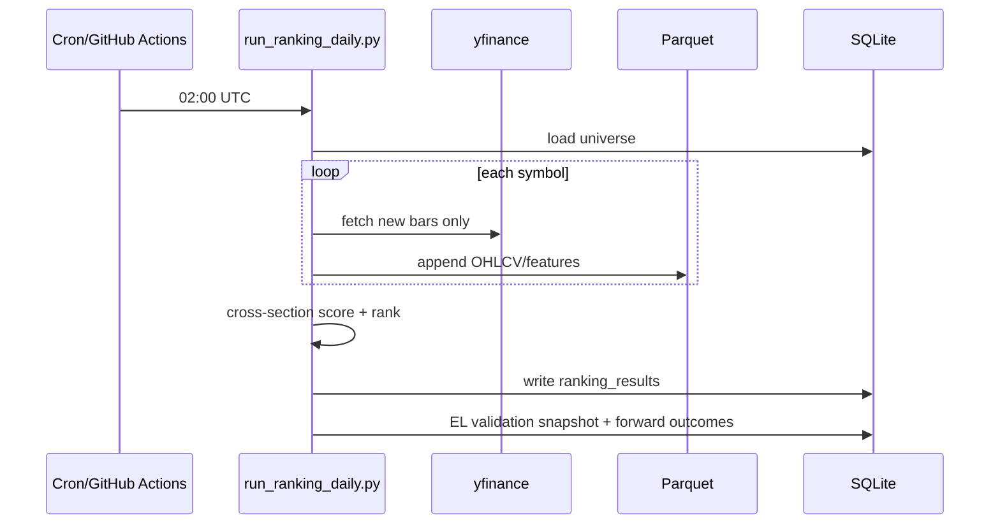

# Stock Ranking Pipeline — System Architecture

Backend-first pipeline that scores US equities for **5-session excess return vs SPY**, stores precomputed ranks, and serves them via API. Mobile/web clients consume results only.

## Goals

| Layer | Responsibility |
|--------|----------------|
| **Trend Analysis (app)** | Model probabilities, raw metrics |
| **Ranking pipeline (batch)** | Universe, OHLCV, features, composite + ML scores, nightly snapshots |
| **Ranking API** | Top-N, scores, probabilities, contribution breakdown |

## High-Level Architecture



### Production realism extensions (v2)

| Module | Role |
|--------|------|
| `regime/` | SPY trend + volatility → `regime_id`, `regime_multiplier` on `final_score` |
| `features/decay.py` | Exponential decay on momentum/volume before scoring |
| `validation/leakage.py` | Enforce features ≤ T; shifted rolling highs |
| `ml/labels.py` | Regression (`excess_ret_5d`) + top-quintile classification |
| `backtest/` | Simulated long top-N, 5-session hold, slippage/ADV costs, metrics → SQLite |

### File structure (additions)

```
ranking_pipeline/
  regime/
    detector.py          # regime_id per day from SPY
    multipliers.py       # regime_id → score multiplier
  features/
    decay.py             # EWM decay on momentum/volume columns
  validation/
    leakage.py           # no-leakage checks
  ml/
    labels.py            # target definitions + quintile labeling
  backtest/
    costs.py             # slippage + liquidity penalty
    simulator.py         # long top-N, hold 5 sessions
    metrics.py           # Sharpe, hit rate, drawdown
    evaluate.py          # nightly eval hook
  storage/
    schema.sql           # + market_regime_daily, backtest_*
```

### Data flow changes

1. **After OHLCV update:** recompute SPY regime series → persist `market_regime_daily`.
2. **Feature build:** rolling highs use `shift(1)` (no same-bar high leakage); apply EWM decay to momentum/volume columns.
3. **Ranking:** composite (+ optional ML) → blend → **`final_score *= regime_multiplier`** (damp momentum in chop/risk-off).
4. **Post-rank:** backtest top-N from run → gross forward excess from labels → subtract slippage/liquidity costs → store `backtest_runs` + `backtest_metrics`.
5. **Training:** classifier target configurable (`outperform_spy` \| `top_quintile`); regressor always `excess_ret_5d`; quintile labels computed cross-sectionally per date (no leakage).

## Module Layout

```
ranking_pipeline/
  config.py              # Weights, filters, paths, model backend
  universe/              # US listings download + liquidity screen
  storage/               # SQLite metadata + Parquet I/O helpers
  features/              # Ranking-specific feature matrix
  scoring/               # Normalized composite score + contributions
  ml/                    # Dataset build, train, predict (multi-backend)
  pipeline/              # daily.py, weekly_universe.py orchestration
  api_models.py          # Pydantic response models
```

Reuses existing packages:

- `data/store.py` — OHLCV Parquet (extended with incremental append)
- `features/indicators.py`, `features/patterns.py` — indicators + candlesticks
- `features/market_context.py` — SPY-relative strength at panel time
- `models/labels.py` — `excess_ret_5d`, 5-day horizon

## Database Schema (SQLite)

File: `data/ranking/ranking_pipeline.db` (configurable via `RANKING_DB_PATH`).

```sql
-- Weekly refreshed investable universe
CREATE TABLE universe_snapshots (
  snapshot_id TEXT PRIMARY KEY,          -- e.g. 2026-06-02
  created_at TEXT NOT NULL,
  symbol_count INTEGER NOT NULL
);

CREATE TABLE universe_members (
  snapshot_id TEXT NOT NULL,
  symbol TEXT NOT NULL,
  last_close REAL,
  market_cap REAL,
  avg_dollar_volume_20d REAL,
  passed_filters INTEGER NOT NULL,
  PRIMARY KEY (snapshot_id, symbol)
);

-- OHLCV sync metadata (Parquet is source of truth for bars)
CREATE TABLE ohlcv_sync (
  symbol TEXT PRIMARY KEY,
  last_bar_date TEXT,
  row_count INTEGER,
  updated_at TEXT NOT NULL
);

-- Nightly ranking runs
CREATE TABLE ranking_runs (
  run_id TEXT PRIMARY KEY,               -- UUID or YYYY-MM-DDTHH
  as_of_date TEXT NOT NULL,                -- feature date used
  model_backend TEXT,                      -- composite | xgboost | lightgbm | catboost
  universe_snapshot_id TEXT,
  symbol_count INTEGER,
  created_at TEXT NOT NULL
);

CREATE TABLE ranking_results (
  run_id TEXT NOT NULL,
  symbol TEXT NOT NULL,
  rank INTEGER NOT NULL,
  composite_score REAL,
  ml_probability REAL,
  expected_excess_return REAL,
  final_score REAL NOT NULL,
  contributions_json TEXT NOT NULL,
  PRIMARY KEY (run_id, symbol)
);

CREATE INDEX idx_ranking_results_run_rank ON ranking_results(run_id, rank);

-- SPY market regime (daily)
CREATE TABLE market_regime_daily (
  date TEXT PRIMARY KEY,
  regime_id TEXT NOT NULL,
  regime_multiplier REAL NOT NULL,
  metadata_json TEXT
);

-- Backtest evaluation per ranking run
CREATE TABLE backtest_runs (
  backtest_id TEXT PRIMARY KEY,
  ranking_run_id TEXT NOT NULL,
  as_of_date TEXT NOT NULL,
  top_n INTEGER NOT NULL,
  hold_days INTEGER NOT NULL,
  created_at TEXT NOT NULL
);

CREATE TABLE backtest_metrics (
  backtest_id TEXT PRIMARY KEY,
  avg_return REAL,
  avg_excess_return REAL,
  hit_rate_vs_spy REAL,
  sharpe_ratio REAL,
  max_drawdown REAL,
  slippage_bps REAL,
  costs_json TEXT
);
```

**Design choice:** OHLCV and full feature history stay in **Parquet** (`data/raw`, `data/ranking/features`) for throughput. SQLite holds universe manifests, run metadata, and **latest ranked rows** for API latency.

## Feature Engineering Design

Per symbol, daily row (after warmup), columns:

| Group | Features |
|-------|----------|
| **Trend** | `close_vs_sma20`, `close_vs_sma50`, `close_vs_sma200`, `sma20_slope_5d`, `sma50_slope_5d` |
| **Relative strength** | `excess_ret_5d_vs_spy`, `excess_ret_20d_vs_spy`, `excess_ret_60d_vs_spy` |
| **Volume** | `rel_volume` (vs 20d avg), `vol_ratio_20d` |
| **Breakout** | `dist_20d_high`, `dist_52w_high`, `new_high_20d`, `new_high_52w` |
| **Volatility** | `atr_14`, `atr_percentile_252d` |
| **Pattern** | `pat_engulfing`, `pat_hammer`, `pat_morningstar`, … (signed TA-Lib/pandas-ta) |

SPY benchmark series loaded once per batch; excess returns computed vs aligned SPY closes.

**Warmup:** 252 trading days minimum before emitting rows (52-week high + ATR percentile).

**Incremental updates:** load existing feature Parquet, recompute tail window (~300 bars), merge by date, write back.

## Composite Ranking Engine

1. For each feature group, z-score cross-sectionally on universe (winsorize 1%/99%).
2. Group score = mean of normalized features in group (direction-aware: higher dist to high = bearish breakout group inverted).
3. `composite_score = Σ weight_g * group_score_g` (weights sum to 1, configurable in `RankingPipelineConfig`).

Default weights:

- Relative strength: 40%
- Trend: 25%
- Volume: 20%
- Breakout: 10%
- Pattern: 5%

`contributions_json` stores per-group weighted contribution for API breakdown.

## Machine Learning Layer

**Training sample:** row at date T = feature vector (all inputs ≤ T close). Targets:

| Target | Column | Definition |
|--------|--------|------------|
| Regression | `excess_ret_5d` | Forward 5-session stock return minus SPY (aligned shift) |
| Classification (default legacy) | `label_outperform_spy_5d` | `excess_ret_5d > 0` |
| Classification (quintile) | `label_top_quintile_5d` | Top 20% `excess_ret_5d` within universe on date T |

Quintile labels are computed cross-sectionally per date after forward returns are known for training rows only.

**Backends** (pluggable via `ModelBackend` enum):

- `xgboost` — existing `models/xgb_model.py` patterns
- `lightgbm` — `LGBMClassifier` / `LGBMRegressor`
- `catboost` — `CatBoostClassifier` / `CatBoostRegressor`

**Outputs per symbol (inference):**

- `ml_probability` — P(outperform SPY)
- `expected_excess_return` — regression head on same features (5d excess return)
- `final_score` — `0.6 * ml_probability + 0.4 * composite_norm` (configurable)

Artifacts: `artifacts/ranking_model/{backend}/` (classifier + regressor joblib + meta JSON).

## Update Pipeline Design

### Weekly — universe refresh (`scripts/run_ranking_universe_weekly.py`)

1. Download NASDAQ + NYSE symbol directories (no hardcoded ticker list).
2. Exclude ETFs, warrants, test issues, symbols with `.` quirks.
3. For candidates (~6k): download 60d OHLCV (parallel workers, bounded concurrency).
4. Apply liquidity filters; persist `universe_snapshots` + `universe_members`.
5. Set `data/ranking/active_universe.json` pointer to latest snapshot id.

### Nightly — daily pipeline (`scripts/run_ranking_daily.py`)

1. Load active universe symbols from SQLite.
2. **Incremental OHLCV:** `data.store.update_raw_incremental` — fetch since last bar date only.
3. **Features:** recompute ranking features; incremental Parquet merge.
4. **Score:** composite (+ optional ML if artifact present).
5. Rank by `final_score` descending; persist `ranking_runs` + `ranking_results`.
6. Prune old runs (keep last N days).
7. **Emerging Leaders validation** (`run_emerging_leaders_validation_job` via `scripts/run_ranking_daily.py`): daily snapshot of qualifying setups + backfill forward returns vs SPY (does not change live EL ranking).



## Performance Considerations

| Concern | Mitigation |
|---------|------------|
| 2,000+ symbols nightly | Process pool (`max_workers` config); only tail recompute (~300 bars) |
| Cross-section z-score | Vectorized pandas on single date slice |
| yfinance rate limits | Weekly full screen; daily incremental 5–10 bar fetches; lock from `yfinance_bootstrap` |
| API latency | SQLite indexed `ranking_results`; no on-request feature build |
| Disk | Parquet columnar compression; optional feature column pruning |
| Memory | One symbol per worker; SPY loaded once shared read-only |

## Portfolio construction (downstream)

See [`portfolio_construction_architecture.md`](portfolio_construction_architecture.md).

- `ranking_pipeline/portfolio/` — sizing, constraints, rebalance, persist
- `GET /api/v1/portfolio/latest` — weights + risk (ranking API unchanged)
- `scripts/run_portfolio_daily.py` — run after nightly ranking

## Product API (Web + iOS)

Canonical v1 contract via `app/api/product/` (precomputed snapshots only):

| Endpoint | Purpose |
|----------|---------|
| `GET /api/v1/rankings/top` | Top movers + `regime_id` + `api_version` |
| `GET /api/v1/portfolio/latest` | Holdings, metrics, `risk_layer`, turnover |
| `GET /api/v1/health` | Pipeline status, universe size, freshness |

See [`product_serving_architecture.md`](product_serving_architecture.md), [`frontend_integration.md`](frontend_integration.md), [`deployment_runbook.md`](deployment_runbook.md).

## API (legacy batch docs)

`GET /api/v1/rankings/top?limit=20&run_id=optional`

Returns latest run (or specified) top symbols with scores, probabilities, expected excess, contribution breakdown.

## Configuration

Environment / defaults in `ranking_pipeline/config.py`:

- `RANKING_DB_PATH`
- `RANKING_ACTIVE_UNIVERSE_SNAPSHOT` (optional override)
- `RANKING_MODEL_BACKEND`
- `RANKING_COMPOSITE_WEIGHTS` (JSON env)
- `RANKING_MAX_WORKERS`
- `RANKING_CLASSIFICATION_TARGET` (`outperform_spy` | `top_quintile`)
- `RANKING_SLIPPAGE_BPS` (per-side slippage, default 15)

## Testing Strategy

- Unit: feature formulas, composite weights, normalization, contribution sum
- Integration: SQLite roundtrip, incremental OHLCV merge logic (mock frames)
- Pipeline: smoke test on 3-symbol fixture universe
